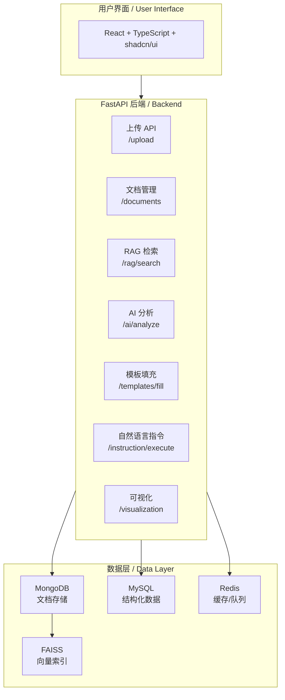
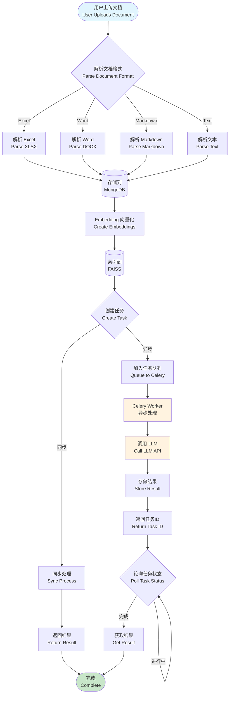

# 智联文档

## 项目介绍 / Project Introduction

基于大语言模型的文档理解与多源数据融合系统，专为第十七届中国大学生服务外包创新创业大赛（A23赛题）开发。本系统利用大语言模型（LLM）解析、分析各类文档格式并提取结构化数据，支持通过自然语言指令自动填写模板表格。

A document understanding and multi-source data fusion system based on Large Language Models (LLM), developed for the 17th China University Student Service Outsourcing Innovation and Entrepreneurship Competition (Topic A23). This system uses LLMs to parse, analyze, and extract structured data from various document formats, supporting automatic template table filling through natural language instructions.

---

## 技术栈 / Technology Stack

| 层次 / Layer | 组件 / Component | 说明 / Description |
|:---|:---|:---|
| 后端 / Backend | FastAPI + Uvicorn | RESTful API，异步任务调度 / API & async task scheduling |
| 前端 / Frontend | React + TypeScript + Vite | 文件上传、表格配置、聊天界面 / Upload, table config, chat UI |
| 异步任务 / Async Tasks | Celery + Redis | 处理耗时的解析与AI提取 / Heavy parsing & AI extraction |
| 文档数据库 / Document DB | MongoDB (Motor) | 元数据、提取结果、文档块存储 / Metadata, results, chunk storage |
| 关系数据库 / Relational DB | MySQL (SQLAlchemy) | 结构化数据存储 / Structured data storage |
| 缓存 / Cache | Redis | 缓存与任务队列 / Caching & task queue |
| 向量检索 / Vector Search | FAISS | 高效相似性搜索 / Efficient similarity search |
| AI集成 / AI Integration | LangChain-style + MiniMax API | RAG流水线、提示词管理 / RAG pipeline, prompt management |
| 文档解析 / Document Parsing | python-docx, pandas, openpyxl, markdown-it | 多格式支持 / Multi-format support |

---

## 项目架构 / Project Architecture



---

## 程序流程 / Program Flow



---

## 目录结构 / Directory Structure

```
FilesReadSystem/
├── backend/                      # 后端服务（Python + FastAPI）
│   ├── app/
│   │   ├── api/endpoints/       # API路由层 / API endpoints
│   │   │   ├── ai_analyze.py    # AI分析接口 / AI analysis
│   │   │   ├── documents.py     # 文档管理 / Document management
│   │   │   ├── instruction.py   # 自然语言指令 / Natural language instruction
│   │   │   ├── rag.py           # RAG检索 / RAG retrieval
│   │   │   ├── tasks.py         # 任务管理 / Task management
│   │   │   ├── templates.py     # 模板管理 / Template management
│   │   │   ├── upload.py        # 文件上传 / File upload
│   │   │   └── visualization.py # 可视化 / Visualization
│   │   ├── core/
│   │   │   ├── database/        # 数据库连接 / Database connections
│   │   │   └── document_parser/ # 文档解析器 / Document parsers
│   │   ├── services/            # 业务逻辑服务 / Business logic services
│   │   │   ├── llm_service.py         # LLM调用 / LLM service
│   │   │   ├── rag_service.py         # RAG流水线 / RAG pipeline
│   │   │   ├── template_fill_service.py # 模板填充 / Template filling
│   │   │   ├── excel_ai_service.py    # Excel AI分析 / Excel AI analysis
│   │   │   ├── word_ai_service.py     # Word AI分析 / Word AI analysis
│   │   │   └── table_rag_service.py   # 表格RAG / Table RAG
│   │   └── instruction/         # 指令解析与执行 / Instruction parsing & execution
│   ├── requirements.txt         # Python依赖 / Python dependencies
│   └── README.md
│
├── frontend/                    # 前端项目（React + TypeScript）
│   ├── src/
│   │   ├── pages/              # 页面组件 / Page components
│   │   │   ├── Dashboard.tsx   # 仪表板 / Dashboard
│   │   │   ├── Documents.tsx    # 文档管理 / Document management
│   │   │   ├── TemplateFill.tsx # 模板填充 / Template fill
│   │   │   └── InstructionChat.tsx # 指令聊天 / Instruction chat
│   │   ├── components/ui/      # shadcn/ui组件库 / shadcn/ui components
│   │   ├── contexts/          # React上下文 / React contexts
│   │   ├── db/                # API调用封装 / API call wrappers
│   │   └── supabase/functions/ # Edge函数 / Edge functions
│   ├── package.json
│   └── README.md
│
├── docs/                       # 文档与测试数据 / Documentation & test data
├── logs/                       # 应用日志 / Application logs
└── README.md                   # 本文件 / This file
```

---

## 主要功能 / Key Features

- **多格式文档解析** / Multi-format Document Parsing
  - Excel (.xlsx)
  - Word (.docx)
  - Markdown (.md)
  - Plain Text (.txt)

- **AI智能分析** / AI-Powered Analysis
  - 文档内容理解与摘要
  - 表格数据自动提取
  - 多文档联合推理

- **RAG检索增强** / RAG (Retrieval Augmented Generation)
  - 语义向量相似度搜索
  - 上下文感知的答案生成

- **模板自动填充** / Template Auto-fill
  - 智能表格模板识别
  - 自然语言指令驱动填写
  - 批量数据导入导出

- **自然语言指令** / Natural Language Instructions
  - 意图识别与解析
  - 多步骤任务自动执行

---

## API接口 / API Endpoints

| 方法 / Method | 路径 / Path | 说明 / Description |
|:---|:---|:---|
| GET | `/health` | 健康检查 / Health check |
| POST | `/upload/document` | 单文件上传 / Single file upload |
| POST | `/upload/documents` | 批量上传 / Batch upload |
| GET | `/documents` | 文档库 / Document library |
| GET | `/tasks/{task_id}` | 任务状态 / Task status |
| POST | `/rag/search` | RAG语义搜索 / RAG search |
| POST | `/templates/upload` | 模板上传 / Template upload |
| POST | `/templates/fill` | 执行模板填充 / Execute template fill |
| POST | `/ai/analyze/excel` | Excel AI分析 / Excel AI analysis |
| POST | `/ai/analyze/word` | Word AI分析 / Word AI analysis |
| POST | `/instruction/recognize` | 意图识别 / Intent recognition |
| POST | `/instruction/execute` | 执行指令 / Execute instruction |
| GET | `/visualization/statistics` | 统计图表 / Statistics charts |

---

## 环境配置 / Environment Setup

### 后端 / Backend

```bash
cd backend

# 创建虚拟环境 / Create virtual environment
python -m venv venv

# 激活虚拟环境 / Activate virtual environment
# Windows PowerShell:
.\venv\Scripts\Activate.ps1
# Windows CMD:
.\venv\Scripts\Activate.bat

# 安装依赖 / Install dependencies
pip install -r requirements.txt

# 复制环境变量模板 / Copy environment template
copy .env.example .env
# 编辑 .env 填入API密钥 / Edit .env with your API keys
```

### 前端 / Frontend

```bash
cd frontend

# 安装依赖 / Install dependencies
npm install

# 或使用 pnpm / Or using pnpm
pnpm install
```

---

## 启动项目 / Starting the Project

### 后端启动 / Backend Startup

```bash
cd backend
./venv/Scripts/python.exe -m uvicorn app.main:app --host 127.0.0.1 --port 8000 --reload
```

### 前端启动 / Frontend Startup

```bash
cd frontend
npm run dev
# 或 / or
pnpm dev
```

前端地址 / Frontend URL: http://localhost:5173

---

## 配置说明 / Configuration

### 环境变量 / Environment Variables

| 变量 / Variable | 说明 / Description |
|:---|:---|
| `MONGODB_URL` | MongoDB连接地址 / MongoDB connection URL |
| `MYSQL_HOST` | MySQL主机 / MySQL host |
| `REDIS_URL` | Redis连接地址 / Redis connection URL |
| `MINIMAX_API_KEY` | MiniMax API密钥 / MiniMax API key |
| `MINIMAX_API_URL` | MiniMax API地址 / MiniMax API URL |

---

## Docker 部署 / Docker Deployment

### 快速启动 / Quick Start

```bash
# 1. 复制环境变量模板并编辑
cp .env.example .env
# 编辑 .env 填入实际配置

# 2. 启动所有服务
docker compose up -d

# 3. 查看日志
docker compose logs -f

# 4. 检查服务状态
docker compose ps

# 5. 更新部署
docker compose up -d --build
```

### 服务说明 / Services

| 服务 | 端口 | 说明 |
|:---|:---|:---|
| frontend | 80 | React 前端 (Nginx) |
| backend | 8000 | FastAPI 后端 |
| mongodb | 27017 | MongoDB 数据库 |
| mysql | 3306 | MySQL 数据库 |
| redis | 6379 | Redis 缓存/队列 |

### 环境变量 / Environment Variables

创建 `.env` 文件，参考 `.env.example`:

```bash
# 数据库配置
MONGO_ROOT_USER=admin
MONGO_ROOT_PASSWORD=your_password
MONGODB_DB_NAME=document_system
MYSQL_PASSWORD=your_password
MYSQL_DATABASE=document
REDIS_PASSWORD=your_password

# LLM 配置
LLM_API_KEY=your_api_key
LLM_BASE_URL=https://api.deepseek.com
LLM_MODEL_NAME=deepseek-chat

# Supabase 配置
SUPABASE_URL=https://your-project.supabase.co
SUPABASE_ANON_KEY=your_anon_key
SUPABASE_SERVICE_KEY=your_service_key
```

### 验证部署 / Verify Deployment

```bash
# 检查所有服务状态
docker compose ps

# 访问前端
curl http://localhost

# 检查后端健康
curl http://localhost:8000/health
```

---

## 许可证 / License

ISC
