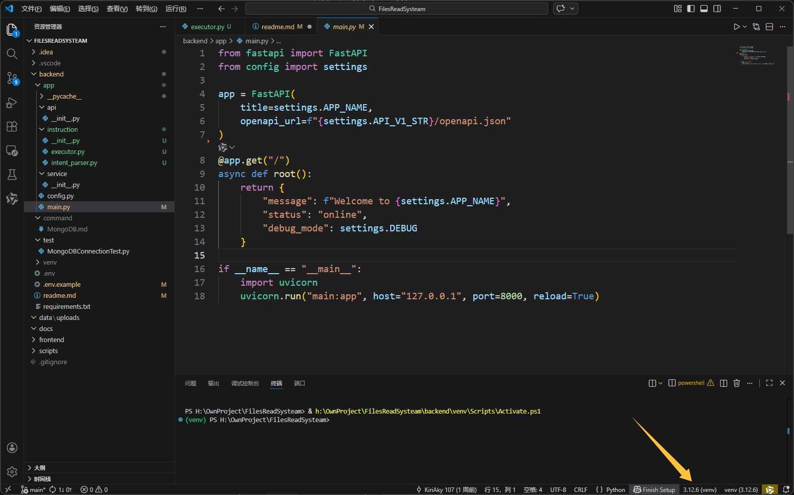
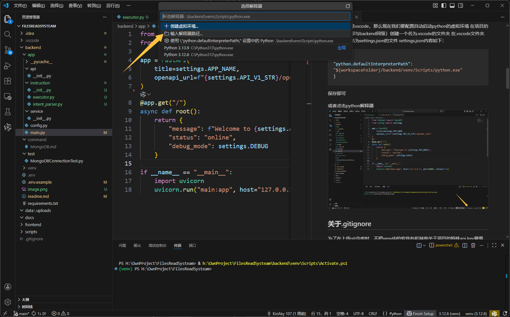

> [!TIP]
>
> 注意，本文档仅为开发过程中团队交流使用，非正式的readme文档。


## 技术栈

| 层次     | 组件                                        | 说明                              |
| :------- | :------------------------------------------ | :-------------------------------- |
| 前端     | Vue 3 / React + Element Plus                | 文件上传、表格配置、聊天界面      |
| 后端     | FastAPI                                     | 提供 RESTful API，异步任务调度    |
| 异步任务 | Celery + Redis                              | 处理耗时的解析与 AI 提取          |
| 数据库   | MongoDB（元数据、提取结果）                 | 存储文档块、最终结构化数据        |
| 向量检索 | faiss-cpu + 本地索引文件                    | 高效相似性搜索，配合 MongoDB 使用 |
| AI 集成  | LangChain + 国内大模型 API                  | RAG 流水线、提示词管理            |
| 文档解析 | python-docx, pandas, markdown, 原生文件操作 | 多格式支持                        |
| 部署     | Docker + Nginx + Gunicorn                   | 打包演示，本地或云服务器运行      |

## 环境配置

部署好项目后，一般在终端都显示目前操作路径为 xx\FilesReadSystem
在终端输入：
```bash
cd backend
```
以进入后端项目目录
此时终端显示目前操作路径为 xx\FilesReadSystem\backend
接着在终端输入：
```bash
python312 -m venv venv
```
以指定python创建python虚拟环境，可确保软件包不会与系统python版本冲突
创建虚拟环境成功后，在终端输入：
```bash
.\venv\Scripts\Activate.ps1 #如果你的终端是powershell，请使用此命令
.\venv\Scripts\Activate.bat #如果你的终端是cmd，请使用此命令
```
激活虚拟环境成功后，在终端输入：
```bash
pip install -r requirements.txt
```
以安装项目需要的依赖包

如果你用的是vscode，那么现在我们要配置自动启动python的虚拟环境
在项目的根目录下（即与backend同级）创建一个名为.vscode的文件夹
在.vscode文件夹中创建一个名为settings.json的文件
settings.json内容如下：
```json
{
"python.defaultInterpreterPath": "${workspaceFolder}/backend/venv/Scripts/python.exe" 
}
```
保存即可

或者点击python解释器


如果你完成了上述setting.json的配置，可以直接选择第三个使用 xxx 设置中的python xxx
否则点击箭头指示的输入解释器路径


找到你项目路径的\venv\Scripts\python.exe

    例如我的：H:\OwnProject\FilesReadSysteam\backend\venv\Scripts\python.exe (记得加上这个.exe)
输入进去即可

## 关于.gitignore
为了在上传git仓库时，不把venv中的软件包和其他关于项目的特殊api key暴露，请将.gitignore文件放在项目根目录下，并添加以下内容：
```bash
/.git/
/.gitignore
/.idea/
/.vscode/
/backend/venv/
/backend/command/
/backend/.env
/backend/.env.local
/backend/.env.*.local
```

## 关于env的说明
为了数据安全，请不要把api key暴露，请将api key保存在.env文件中，并添加到.gitignore中（正如前文所示），这样git就不会将api key上传到git仓库中。
但，可以保留.env.example文件，以示需要调用的api key

## 关于git账户
直接在终端输入以下命令
```bash
#全局设置
git config --global user.name "你的名字"
git config --global user.email "你的邮箱@example.com"

#单个项目设置
cd 你的项目路径
git config user.name "你的项目专用名字"
git config user.email "你的项目专用邮箱@example.com"

#验证
git config --list #查看所有配置

git config user.name #查看单条
git config user.email #同上

#如果想看全局的，可以加上 --global，例如 git config --global user.name
```

需要更新以下库
先进入虚拟机
```bash
cd backend
.\venv\Scripts\Activate.ph1
pip install -r requirements.txt
```

## 启动后端项目
在终端输入以下命令：
```bash
cd backend  #确保启动时在后端跟目录下
./venv/Scripts/python.exe -m uvicorn app.main:app --host 127.0.0.1 --port 8000
 --reload #启动后端项目
```
先启动后端项目，再启动前端项目

记得在你的.gitignore中添加：
```
/backend/data/uploads
/backend/data/charts
```

## 预计项目结构：

```bash
FilesReadSystem/
├── backend/                      # 后端服务（Python + FastAPI）
│   ├── app/                       # 主应用代码
│   │   ├── api/                    # API 路由层
│   │   │   ├── __init__.py
│   │   │   ├── endpoints/           # 各功能模块的路由
│   │   │   │   ├── __init__.py
│   │   │   │   ├── upload.py        # 文件上传接口
│   │   │   │   ├── task.py          # 任务状态查询接口
│   │   │   │   ├── result.py        # 结果获取接口
│   │   │   │   ├── instruction.py   # 自然语言指令接口
│   │   │   │   └── template.py      # 表格模板管理接口
│   │   │   └── dependencies.py      # 通用依赖（如数据库会话）
│   │   ├── core/                    # 核心业务逻辑
│   │   │   ├── __init__.py
│   │   │   ├── document_parser/     # 文档解析模块（第二阶段）
│   │   │   │   ├── __init__.py
│   │   │   │   ├── base.py          # 解析器基类
│   │   │   │   ├── docx_parser.py   # .docx 解析
│   │   │   │   ├── xlsx_parser.py   # .xlsx 解析
│   │   │   │   ├── md_parser.py     # .md 解析
│   │   │   │   ├── txt_parser.py    # .txt 解析
│   │   │   │   └── utils.py         # 清洗、分块等工具函数
│   │   │   ├── rag/                  # RAG 检索增强生成模块（第三阶段）
│   │   │   │   ├── __init__.py
│   │   │   │   ├── embeddings.py     # Embedding 模型封装
│   │   │   │   ├── vector_store.py   # faiss 向量索引管理
│   │   │   │   ├── retriever.py      # 检索器（从 faiss 取回 + MongoDB 补充元数据）
│   │   │   │   └── llm_chain.py      # LLM 调用链（Prompt 模板、解析输出）
│   │   │   ├── table_filler/         # 表格自动填写模块（第三阶段）
│   │   │   │   ├── __init__.py
│   │   │   │   ├── template_reader.py # 读取表格模板结构
│   │   │   │   ├── data_extractor.py  # 根据模板提取数据（调用 RAG + LLM）
│   │   │   │   └── excel_writer.py    # 将数据回填到 Excel
│   │   │   └── instruction/          # 自然语言指令解析模块（第一阶段）
│   │   │       ├── __init__.py
│   │   │       ├── intent_parser.py  # 意图识别
│   │   │       └── executor.py       # 指令执行（调用其他核心模块）
│   │   ├── models/                   # 数据库模型（MongoDB 文档模型）
│   │   │   ├── __init__.py
│   │   │   ├── document.py           # 文档元数据模型
│   │   │   ├── chunk.py              # 文档块模型（用于 faiss 元数据）
│   │   │   ├── task.py                # 异步任务模型
│   │   │   └── result.py              # 提取结果模型
│   │   ├── schemas/                   # Pydantic 模型（请求/响应校验）
│   │   │   ├── __init__.py
│   │   │   ├── file.py
│   │   │   ├── task.py
│   │   │   ├── result.py
│   │   │   └── instruction.py
│   │   ├── services/                  # 服务层（封装数据库操作等）
│   │   │   ├── __init__.py
│   │   │   ├── mongo_service.py       # MongoDB 通用操作
│   │   │   └── file_service.py        # 文件存储服务
│   │   ├── tasks/                      # Celery 异步任务定义
│   │   │   ├── __init__.py
│   │   │   ├── celery_app.py           # Celery 实例
│   │   │   ├── document_tasks.py       # 文档处理任务（解析、向量化、提取）
│   │   │   └── table_tasks.py          # 表格填写任务
│   │   ├── utils/                       # 工具函数
│   │   │   ├── __init__.py
│   │   │   ├── logger.py                # 日志配置
│   │   │   ├── file_utils.py            # 文件操作
│   │   │   └── exceptions.py            # 自定义异常
│   │   ├── config.py                     # 应用配置（环境变量读取）
│   │   ├── main.py                        # FastAPI 应用入口
│   │   └── dependencies.py                # 全局依赖
│   ├── tests/                          # 测试目录（原有 MongoDBConnectionTest.py 保留）
│   │   ├── __init__.py
│   │   ├── conftest.py                  # pytest  fixtures
│   │   ├── test_api/                     # API 测试
│   │   │   ├── test_upload.py
│   │   │   └── ...
│   │   ├── test_core/                    # 核心模块单元测试
│   │   │   ├── test_document_parser.py
│   │   │   └── ...
│   │   ├── test_tasks/                   # 任务测试
│   │   └── MongoDBConnectionTest.py      # 已存在的 MongoDB 连接测试
│   ├── venv/                            # Python 虚拟环境（gitignore）
│   ├── requirements.txt                  # Python 依赖
│   ├── requirements-dev.txt              # 开发依赖（如 pytest, black）
│   ├── .env.example                       # 环境变量示例
│   ├── Dockerfile                         # 后端 Docker 镜像构建文件
│   ├── docker-compose.yml                 # 本地开发服务编排（MongoDB, Redis, 后端）
│   └── README.md                          # 后端说明文档
│
├── frontend/                           # 前端项目（Vue/React）
│   ├── public/
│   ├── src/
│   │   ├── api/                         # 后端 API 调用封装
│   │   ├── components/                   # 通用组件
│   │   ├── views/                        # 页面视图
│   │   │   ├── UploadView.vue            # 文件上传页
│   │   │   ├── TaskStatusView.vue        # 任务状态页
│   │   │   ├── ResultView.vue            # 结果展示页
│   │   │   └── InstructionView.vue       # 自然语言指令交互页
│   │   ├── router/                       # 路由配置
│   │   ├── store/                        # 状态管理
│   │   ├── App.vue
│   │   └── main.js
│   ├── package.json
│   ├── vue.config.js / vite.config.js
│   ├── Dockerfile                         # 前端 Docker 镜像构建文件
│   └── README.md
│
├── data/                                # 本地数据目录（gitignore）
│   ├── uploads/                          # 上传文件临时存储
│   ├── faiss_index/                       # faiss 索引文件保存位置
│   └── outputs/                           # 生成的表格文件下载缓存
│
├── docs/                                 # 项目文档（提交材料准备）
│   ├── 01_项目概要介绍.md
│   ├── 02_项目简介PPT.pptx
│   ├── 03_项目详细方案.md
│   ├── 04_演示视频说明.md
│   ├── 05_企业要求材料/
│   │   ├── 训练素材来源说明.md
│   │   ├── 关键模块概要设计与创新要点.md
│   │   └── Demo运行说明.md
│   └── 06_其他补充材料/
│
├── scripts/                             # 辅助脚本
│   ├── build_faiss_index.py              # 预构建向量索引（基于已有文档集）
│   ├── generate_test_data.py              # 生成模拟测试数据
│   └── evaluate.py                        # 准确率评估脚本
│
├── .gitignore
├── README.md                             # 项目总 README
└── docker-compose.yml                     # 全局编排（包含前端、后端、数据库、Redis）
```
